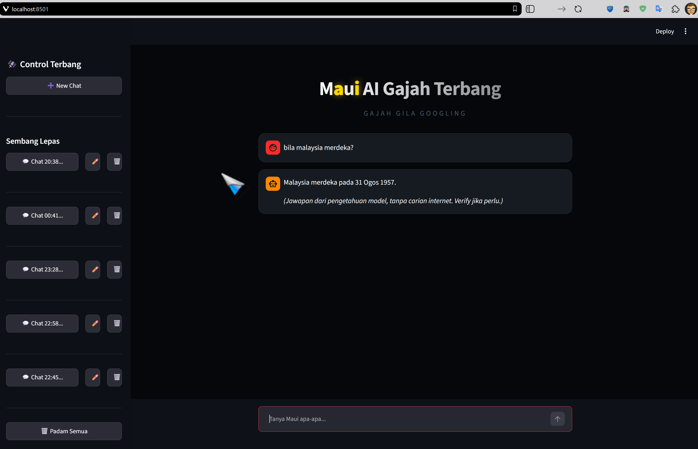
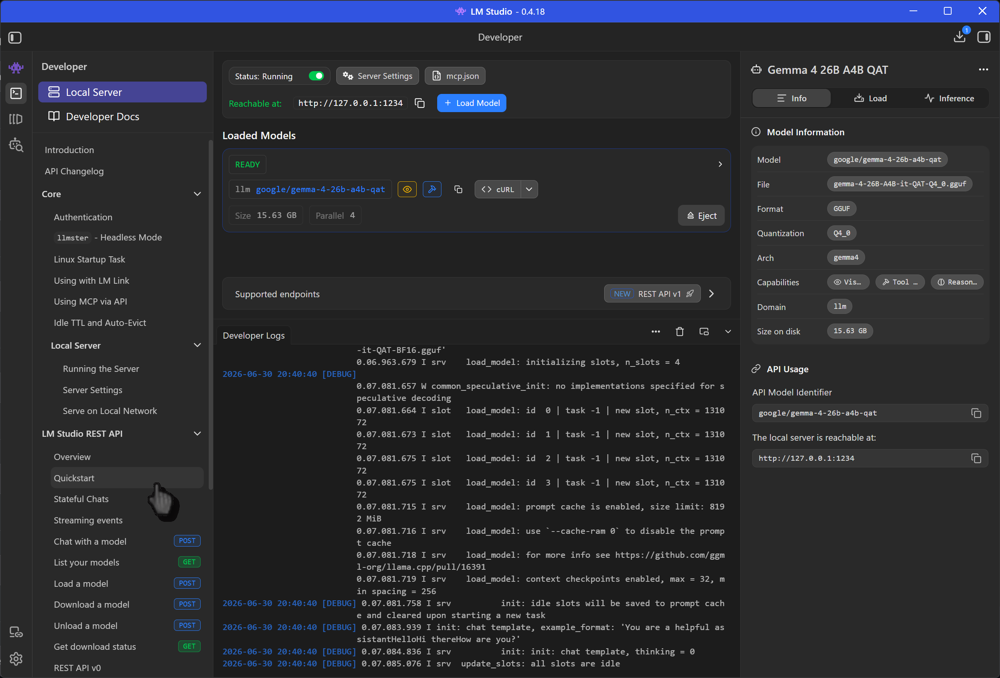

# Maui AI Gajah Terbang 🐘

Pembantu penyelidikan berasaskan **Streamlit** yang menggunakan **LLM tempatan** (LM Studio) untuk menjawab soalan. Untuk setiap soalan, ia **fikir dulu**:

1. Cuba jawab terus dari pengetahuan model (cepat, tak perlu internet), kalau soalan itu ilmu umum,
2. Kalau perlu data terkini / fakta khusus / model tak pasti, baru search di **DuckDuckGo**,
3. Baca dan ekstrak teks dari page teratas (guna `trafilatura`),
4. Bahagikan kandungan kepada blok, pilih yang relevan,
5. Hantar blok terbaik ke LLM tempatan untuk hasilkan jawapan dalam bahasa pengguna.

Sejarah chat disimpan secara tempatan dalam fail `maui_chats.json`.

---

## Tangkap layar

**Antaramuka utama.** Sidebar untuk urus sejarah chat (New Chat, Sembang Lepas, Padam Semua). Untuk soalan ilmu umum, model jawab terus dari pengetahuan sendiri tanpa carian internet:

<p align="center">
  
</p>

**"Fikir dulu."** Untuk setiap soalan, model tentukan dulu sama ada perlu search internet atau cukup jawab terus:

<p align="center">
  
</p>

---

## Prerequisites

Ada dua benda kena pasang dulu sebelum run app ni: **Python + pip** (untuk jalankan kod Streamlit) dan **LM Studio** (untuk LLM tempatan yang jawab soalan). Ikut urutan bawah.

### Python & pip

1. Pasang **Python 3.10 atau lebih baru** dari [python.org](https://www.python.org/downloads/).
   - **Windows:** semak kotak **"Add Python to PATH"** masa install. Penting, kalau tak, `python` dan `pip` tak dikenali dalam terminal.
   - **macOS:** `brew install python`.
   - **Linux (Debian/Ubuntu):** `sudo apt install python3 python3-pip`.
2. Verify kedua-duanya dah ada:
   ```bash
   python --version      # patut 3.10 ke atas
   pip --version         # patut ada
   ```
   - Sesetengah mesin guna `python3` / `pip3` ganti `python` / `pip`, tukar kalau command tak dikenali.
3. Kalau `pip` tak jumpa, pasang dia:
   ```bash
   python -m ensurepip --upgrade
   ```

### Pasang dependencies

Dengan Python + pip dah sedia, pasang package yang app perlukan:

```bash
pip install -r requirements.txt
```

Digalakkan guna **virtual environment** supaya package ni tak konflik dengan projek lain di mesin anda:

```bash
python -m venv .venv
.venv\Scripts\activate          # Windows
# source .venv/bin/activate     # macOS / Linux
pip install -r requirements.txt
```

Selepas itu, setup LM Studio (Langkah 1-4 di bawah). App jawab soalan guna LLM tempatan di mesin anda, bukan API cloud.

### Langkah 1: Pasang LM Studio

- Download dari **[lmstudio.ai](https://lmstudio.ai/)** (Windows / macOS / Linux) dan pasang.
- Buka LM Studio.

### Langkah 2: Download model

- Pergi ke tab **Discover** (icon kaca mata di sidebar kiri).
- Cari model. Contoh yang disyorkan: **`google/gemma-4-2b-qat`** (boleh cari kata kunci `gemma` / `qat`), tapi anda boleh guna apa-apa model.
- Pilih fail dalam format **GGUF** yang sesuai dengan RAM/VRAM mesin anda (size kecil = ringan & pantas, size besar = lebih pandai tapi perlukan lebih banyak memory).
- Klik **Download** dan tunggu sampai siap (model boleh beberapa GB, bergantung pada size).

> Tip: kalau mesin anda kurang RAM/V RAM, pilih varian model yang lebih kecil (cth. versi `2b`). Varian besar (7b+) mungkin perlukan GPU.

### Langkah 3: Hidupkan server

- Pergi ke tab **Developer** (icon `</>` di sidebar kiri) → bahagian **Server**.
- Daripada dropdown model, pilih model yang baru anda download.
- Klik **Load** untuk muatkan model ke dalam server.
- Klik **Start Server**. Server akan hidup (secara default) di:

  ```
  http://localhost:1234
  ```

- (Server ni OpenAI-compatible, jadi `langchain-openai` boleh terus guna.) Pastikan status server = **Running**.
- Boleh verify: buka `http://localhost:1234/v1/models` dalam browser, patut nampak senarai model yang diload.

Contoh server LM Studio yang dah hidup di `http://localhost:1234` (status **Running**, model diload = READY):

<p align="center">
  
</p>

### Langkah 4: Model (auto-detect, tak perlu ubah apa-apa)

Skrip **auto-detect** model yang tengah diload dalam LM Studio. Ia panggil endpoint `http://localhost:1234/v1/models` dan ambil model pertama yang diload. Jadi anda **tak perlu** ubah apa-apa dalam skrip.

- Kalau anda download model lain dan load dia je, script auto tangkap.
- Kalau server tak running atau tiada model diload, app akan tunjuk mesej: **"Tak dapat model dari LM Studio. Pastikan LM Studio running dan ada model diload."**

> Peringatan: kalau anda load **beberapa model serentak** dalam LM Studio, script cuma ambil yang **pertama** dalam senarai. Untuk elakkan salah model, load satu model je.

> Tanpa LM Studio berjalan di `localhost:1234`, app takkan dapat jawab soalan.

## Run

```bash
streamlit run Maui_AI_Gajah_Terbang.py
```

Browser akan terbuka dengan app tersebut.

## Cara ia berfungsi

- **Fikir dulu:** model cuba jawab terus dari pengetahuan sendiri untuk soalan ilmu umum. Tak search langsung, jadi laju.
- **Carian (bila perlu):** DuckDuckGo (tiada API key diperlukan), hanya bila model tak pasti atau soalan perlukan data terkini / fakta khusus.
- **Ekstraksi page:** `trafilatura`.
- **Tokenisasi:** `tiktoken`.
- **LLM:** melalui `langchain-openai` ke server LM Studio tempatan.
- **Sejarah chat:** disimpan ke `maui_chats.json` (tempatan, jangan dikongsikan).

## Konfigurasi

Tetapan utama ada di bahagian `# --- CONFIGURATION ---` dalam skrip:

- `BASE_URL`: URL server LM Studio (default `http://localhost:1234/v1`).
- `CHAT_HISTORY_FILE`: fail simpanan sejarah chat.
- `DIRECT_ANSWER_FIRST`: `True` (default) = model jawab dulu, search internet hanya bila perlu. `False` = sentiasa search (behavior lama).

Model LLM **tak perlu config**, ia auto-detect dari LM Studio (lihat Langkah 4).

## License

Dilesenkan di bawah **BSD 2-Clause License**, lihat fail [LICENSE](LICENSE).
